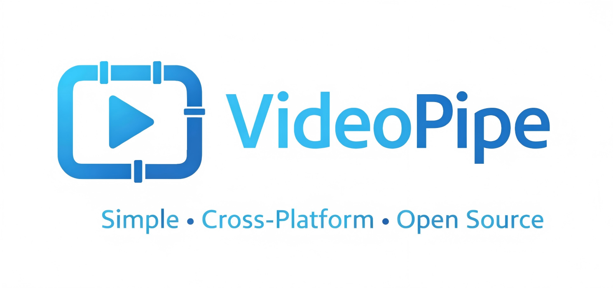
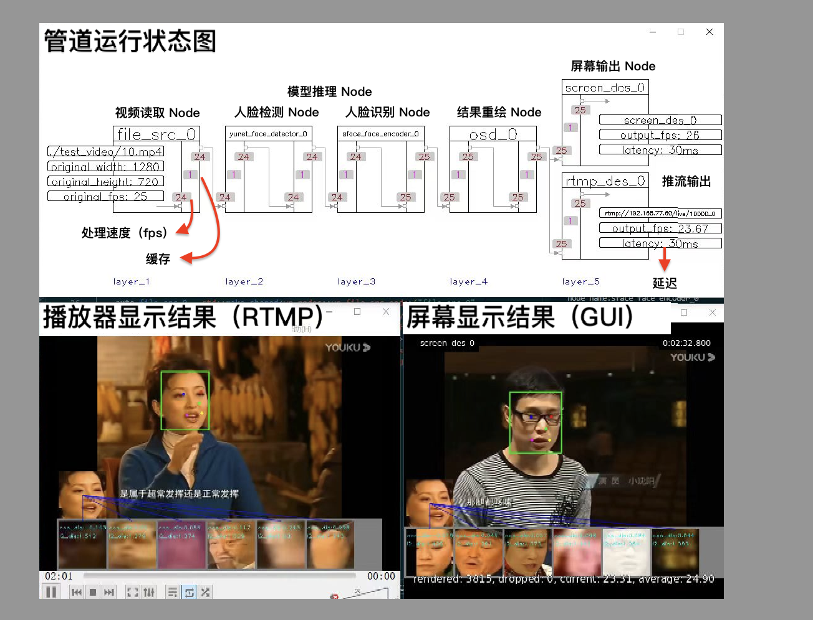
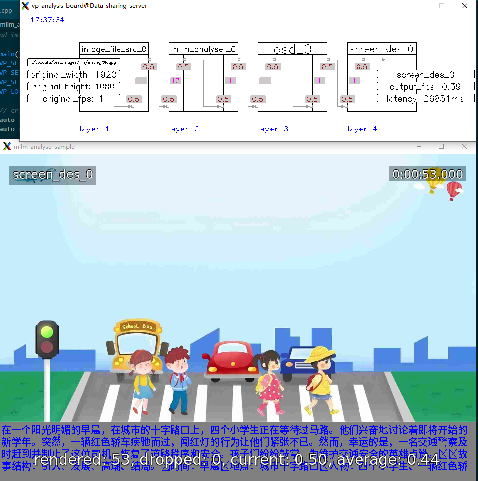

<p style="" align="center">
  
</p>
<p style="margin:0px" align="center">
  <a href='./README_CN.md'>中文README</a> | <a href='http://www.videopipe.cool'>VideoPipe Website </a> | <a href='http://www.videopipe.cool/index.php/2024/09/11/videopipetutorials/'>VideoPipe tutorials(视频教程) </a>
</p>
<p style="margin:0px" align="center">
  <a href='https://github.com/sherlockchou86/one-yolo'>🚀one-yolo, make all in one for Yolo integration. All Tasks, All Versions, All Runtimes. 🚀</a>
</p>

---

## Introduction

`VideoPipe` is a framework for video analysis and structuring, written in C++. It has minimal dependencies and is easy to use. It operates like a pipeline, where each node is independent and can be combined in various ways. `VideoPipe` can be used to build different types of video analysis applications, suitable for scenarios such as video structuring, image search, face recognition, and behavior analysis in traffic/security fields (such as traffic incident detection).


## Advantages and Features

`VideoPipe` is similar to NVIDIA's DeepStream and Huawei's mxVision frameworks, but it is easier to use and more portable.

Here is a comparison table:

| **Name**      | **Open Source** | **Learning Curve** | **Supported Platforms** | **Performance** | **Third-Party Dependencies** |
|---------------|-----------------|---------------------|--------------------------|-----------------|-------------------------------|
| DeepStream    | No              | High                | NVIDIA only              | High            | Many                          |
| mxVision      | No              | High                | Huawei only              | High            | Many                          |
| VideoPipe     | Yes             | Low                 | Any platform             | Medium          | Few                           |

`VideoPipe` uses a plugin-oriented coding style that allows for flexible configuration based on different needs. We can use independent plugins (referred to as `Node` types within the framework) to build various types of video analysis applications. You only need to prepare the model and understand how to parse its output. Inference can be implemented using different backends, such as OpenCV::DNN (default), TensorRT, PaddleInference, ONNXRuntime, or any other backend you prefer.


## Demonstration

https://github.com/sherlockchou86/video_pipe_c/assets/13251045/b1289faa-e2c7-4d38-871e-879ae36f6d50

To watch in fullscreen, use the button in the bottom right corner of the player，[more video demos](./SAMPLES.md)

## Functions

`VideoPipe` is a framework that simplifies the integration of computer vision algorithm models. It is important to note that it is not a deep learning framework like TensorFlow or TensorRT. The main features of `VideoPipe` are as follows:

- **Stream Reading**: Supports mainstream video stream protocols such as UDP, RTSP, RTMP, file, and application. It also supports image reading.
- **Video Decoding**: Supports video and image decoding based on OpenCV/GStreamer (with hardware acceleration).
- **Algorithm Inference**: Supports multi-level inference based on deep learning algorithms, such as object detection, image classification, feature extraction, and image generation. It also supports the integration of traditional image algorithms. **Support mLLM(Multimodal Large Language Model) integration now (update 2025/8/12)**
- **Object Tracking**: Supports object tracking, such as IOU and SORT tracking algorithms.
- **Behavior Analysis (BA)**: Supports behavior analysis based on tracking, such as traffic behavior detection like line-crossing, parking, and violations.
- **Business Logic**: Allows integration of any custom business logic, which can be closely related to specific business requirements.
- **Data Proxy**: Supports pushing structured data (in JSON, XML, or custom formats) to the cloud, files, or other third-party platforms via methods like Kafka or Socket.
- **Recording**: Supports video recording for specific time periods and capturing screenshots of specific frames, with the ability to save them as files.
- **On-Screen Display (OSD)**: Supports overlaying structured data and business logic processing results onto frames.
- **Video Encoding**: Supports video and image encoding based on OpenCV/GStreamer (with hardware acceleration).
- **Stream Pushing**: Supports mainstream video stream protocols such as UDP, RTSP, RTMP, file, and application. It also supports image streaming.

## Getting Started Quickly

### Dependencies

Platforms
- Ubuntu 18.04 x86_64 NVIDIA rtx/tesla GPUs
- Ubuntu 18.04 aarch64 NVIDIA jetson serials device，tx2 tested
- Ubuntu 22.04 x86_64 by VMware virtual machine on Windows 10, pure CPUs
- Ubuntu 18.04 x86_64 Cambrian MLU serials device, MLU 370 tested (code not provided)
- Ubuntu 18.04 aarch64 Rockchip RK35** serials device, RK3588 tested (code not provided)
- Ubuntu 22.04 aarch64 Ascend 310/910 serials device, Atlas 300I-Pro tested (code not provided)
- Wait for your test

Basics
- C++ 17
- OpenCV >= 4.6
- GStreamer 1.14.5 (Required by OpenCV)
- GCC >= 7.5

Optional, if you need to implement your own inference backend or use a backend other than `opencv::dnn`.
- CUDA
- TensorRT
- Paddle Inference
- ONNX Runtime
- mLLM（Ollama/vLLM/OpenAI-compatible API Services）
- Anything you like

[how to install CUDA and TensorRT](./third_party/trt_vehicle/README.md)

[how to install Paddle_Inference](./third_party/paddle_ocr/README.md)

### Build VideoPipe on windows
1. Install Vcpkg on windows
2. .\vcpkg install opencv[freetype,contrib] tinyexpr ffmpeg[x264]
3. change branch win-dev
4. use cmake-gui to configure and generate project files

ps:because gstreamer is poor for windows, only recommend to use ffmpeg backend.
if you encounter any compilation errors, try converting the error file to utf8 bom encoding.

### Compilation and Debugging

1. run `git clone https://github.com/sherlockchou86/VideoPipe.git`
2. run `cd VideoPipe`
3. run `mkdir build && cd build`
4. run `cmake ..`
5. run `make -j8`

After compilation, all library files are stored in `build/libs`, and all sample executables are located in `build/bin`. During Step 4, you can add some compilation options:

- `-DVP_WITH_CUDA=ON` (Compile CUDA-related features; default is OFF)
- `-DVP_WITH_TRT=ON` (Compile TensorRT-related features and samples; default is OFF)
- `-DVP_WITH_PADDLE=ON` (Compile PaddlePaddle-related features and samples; default is OFF)
- `-DVP_WITH_KAFKA=ON` (Compile Kafka-related features and samples; default is OFF)
- `-DVP_WITH_LLM=ON` (Compile LLM-related features and samples; default is OFF)
- `-DVP_BUILD_COMPLEX_SAMPLES=ON` (Compile advanced samples; default is OFF)

For example, to enable CUDA and TensorRT modules, you can run:
```bash
cmake -DVP_WITH_CUDA=ON -DVP_WITH_TRT=ON ..
```
If you run just:
```bash
cmake ..
```
all code will be executed on the CPU.

To run the compiled samples, first download the model files and test data:

1. [Google Drive - Download test files and models](https://drive.google.com/drive/folders/1v9dVcR6xttUTB-WPsH3mZ_ZZMzD4wG-v?usp=sharing)
2. [Baidu Drive - Download test files and models](https://pan.baidu.com/s/1jr2nBnEDmuNaM5DiMjbC0g?pwd=nf53)

Place the downloaded directory (named `vp_data`) in any location (e.g., `/root/abc`). Then, run the sample in the same directory where `vp_data` is located. For example, execute the command:

```bash
[path to VideoPipe]/build/bin/1-1-1_sample
```
at `/root/abc`.

**Note**: The `./third_party/` directory contains independent projects. Some are header-only libraries directly referenced by VideoPipe, while others include CPP files that can be compiled or run independently. VideoPipe depends on these libraries, and they will be automatically compiled during the VideoPipe build process. These libraries also contain their own samples; for specific usage instructions, refer to the README files in the corresponding subdirectories.

### How to use

Here’s a guide on how to build and run a sample pipeline with `VideoPipe`. You can either compile `VideoPipe` as a library and link it, or directly include the source code and compile the entire application.

Below is a sample code demonstrating how to construct a pipeline and run it. Please make sure to update the file paths in the code accordingly:

```c++
#include "../nodes/vp_file_src_node.h"
#include "../nodes/infers/vp_yunet_face_detector_node.h"
#include "../nodes/infers/vp_sface_feature_encoder_node.h"
#include "../nodes/osd/vp_face_osd_node_v2.h"
#include "../nodes/vp_screen_des_node.h"
#include "../nodes/vp_rtmp_des_node.h"
#include "../utils/analysis_board/vp_analysis_board.h"

/*
* Name: 1-1-N Sample
* Complete code located at: samples/1-1-N_sample.cpp
* Functionality: 1 video input, 1 video analysis task (face detection and recognition), 2 outputs (screen display/RTMP stream)
*/

int main() {
    VP_SET_LOG_INCLUDE_CODE_LOCATION(false);
    VP_SET_LOG_INCLUDE_THREAD_ID(false);
    VP_LOGGER_INIT();

    // 1. Create nodes
    // Video Source Node
    auto file_src_0 = std::make_shared<vp_nodes::vp_file_src_node>("file_src_0", 0, "./test_video/10.mp4", 0.6);
    
    // 2. Model Inference Nodes
    // First-level inference: Face detection
    auto yunet_face_detector_0 = std::make_shared<vp_nodes::vp_yunet_face_detector_node>("yunet_face_detector_0", "./models/face/face_detection_yunet_2022mar.onnx");
    // Second-level inference: Face recognition
    auto sface_face_encoder_0 = std::make_shared<vp_nodes::vp_sface_feature_encoder_node>("sface_face_encoder_0", "./models/face/face_recognition_sface_2021dec.onnx");
    
    // 3. OSD Node
    // Draw results on frames
    auto osd_0 = std::make_shared<vp_nodes::vp_face_osd_node_v2>("osd_0");
    
    // Screen Display Node
    auto screen_des_0 = std::make_shared<vp_nodes::vp_screen_des_node>("screen_des_0", 0);
    // RTMP Stream Node
    auto rtmp_des_0 = std::make_shared<vp_nodes::vp_rtmp_des_node>("rtmp_des_0", 0, "rtmp://192.168.77.60/live/10000");

    // Build the pipeline by linking the nodes
    yunet_face_detector_0->attach_to({file_src_0});
    sface_face_encoder_0->attach_to({yunet_face_detector_0});
    osd_0->attach_to({sface_face_encoder_0});

    // Split the pipeline automatically to display results on screen and stream via RTMP
    screen_des_0->attach_to({osd_0});
    rtmp_des_0->attach_to({osd_0});

    // Start the pipeline
    file_src_0->start();

    // Visualize the pipeline
    vp_utils::vp_analysis_board board({file_src_0});
    board.display();
}
```

**Note**: Running this code will show three displays:
1. **Pipeline Status**: A live update of the pipeline’s status.
2. **Screen Output**: The GUI display showing results.
3. **RTMP Output**: The streaming output available at the specified RTMP URL.




### Prototype Examples
|ID|Sample|Screenshot|
|--|--|--|
|1|face_tracking_sample||
|2|vehicle_tracking_sample||
|3|mask_rcnn_sample||
|4|openpose_sample||
|5|face_swap_sample||
|6|mllm_analyse_sample||

A total of over 40 prototype examples are available. [Click here](./SAMPLES.md) to view more.

## Read More
- [Sample Code](./samples)
- [Node Table](./nodes/README.md)
- [How VideoPipe Works](./doc/about.md)
- [Development Environment For Reference](./doc/env.md)

## WeChat Discussion Group


## Thanks

<a href="https://hellogithub.com/repository/4284d29e778642a4a51a471ab1eae6f0" target="_blank"></a>
