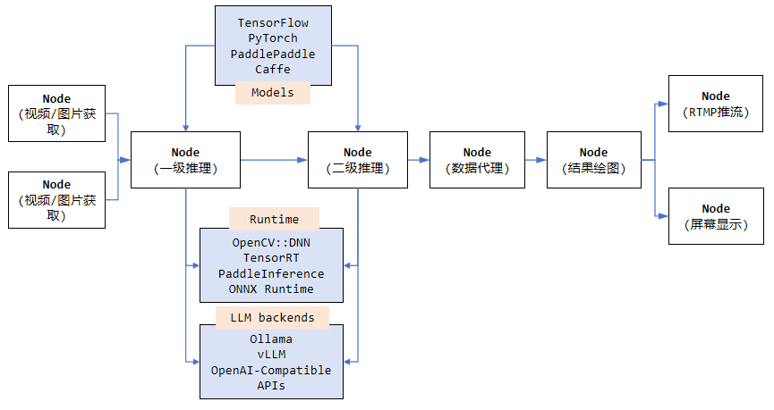

<p style="" align="center">
  
</p>
<p style="margin:0px" align="center">
  <a href='./README.md'>英文README</a> | <a href='http://www.videopipe.cool'>VideoPipe网站</a> | <a href='http://www.videopipe.cool/index.php/2024/09/11/videopipetutorials/'>VideoPipe视频教程</a>
</p>
<p style="margin:0px" align="center">
  <a href='https://github.com/sherlockchou86/one-yolo'>🚀one-yolo, make all in one for Yolo integration. All Tasks, All Versions, All Runtimes. 🚀</a>
</p>

---

## 一、介绍

`VideoPipe` 是一个用于视频分析和结构化的框架，采用 C++ 编写、依赖少、易上手。它像管道一样，其中每个节点相互独立并可自行搭配，`VideoPipe` 可用来构建不同类型的视频分析应用，适用于视频结构化、图片搜索、人脸识别、交通/安防领域的行为分析（如交通事件检测）等场景。


## 二、优势和特点

`VideoPipe` 类似于英伟达的 DeepStream 和华为的 mxVision 框架，但它更易于使用、更具备可移植性。

|名称|是否开源|学习门槛|适用平台|性能|三方依赖|
|--|--|--|--|--|--|
|DeepStream|否|高|仅限英伟达|高|多|
|mxVision|否|高|仅限华为|高|多|
|VideoPipe|是|低|不限平台|中|少|

`VideoPipe` 采用面向插件的编码风格，可以根据不同的需求按需搭配，我们可以使用独立的插件（即框架中的 `Node` 类型），来构建不同类型的视频分析应用。你只需准备好模型并了解如何解析其输出即可，推理可以基于不同的后端实现，如 OpenCV::DNN（默认）、TensorRT、PaddleInference、ONNXRuntime 等，任何你喜欢的都可以。



## 三、演示

https://github.com/sherlockchou86/video_pipe_c/assets/13251045/b1289faa-e2c7-4d38-871e-879ae36f6d50

播放器右下角全屏观看，[更多视频演示](./SAMPLES.md)

## 四、功能

VideoPipe 是一个让计算机视觉算法模型集成更加简单的框架，注意它不是像 TensorFlow、TensorRT 类似的深度学习框架。VideoPipe主要功能如下：

- 流读取：⽀持主流的视频流协议，如 udp、rtsp、rtmp、file、application。同时支持图片读取。
- 视频解码：⽀持基于 OpenCV/GStreamer 的视频和图片解码（⽀持硬件加速）。
- 算法推理：⽀持基于深度学习算法的多级推理，例如⽬标检测、图像分类、特征提取、图像生成等相关网络集成。同时支持传统图像算法集成。**支持多模态大模型（mLLM）集成（2025/8/12更新）**
- ⽬标跟踪：⽀持⽬标追踪，例如 IOU、SORT 跟踪算法等。
- ⾏为分析（BA）：⽀持基于跟踪的⾏为分析，例如越线、停⻋、违章等交通行为判断。
- 业务逻辑：支持任意自定义业务逻辑的集成，可以与业务强相关。
- 数据代理：⽀持将结构化数据（json/xml/⾃定义格式）以 kafka/Sokcet 等⽅式推送到云端、文件或其他第三⽅平台。
- 录制：⽀持特定时间段的视频录制，特定帧的截图，并存文件。
- 屏幕显⽰（OSD）：支持将结构化数据、业务逻辑处理结果绘制到帧上。
- 视频编码：⽀持基于 OpenCV/GStreamer 的视频和图片编码（⽀持硬件加速）。
- 流推送：⽀持主流的视频流协议，如 udp、rtsp、rtmp、file、application。同时支持图片推送。

## 五、快速上手

### 5.1 依赖

平台
- Ubuntu 18.04 x86_64 NVIDIA rtx/tesla GPUs
- Ubuntu 18.04 aarch64 NVIDIA jetson serials device，tx2 tested
- Ubuntu 22.04 x86_64 by VMware virtual machine on Windows 10, pure CPUs
- Ubuntu 18.04 x86_64 Cambrian MLU serials device, MLU 370 tested (code not provided)
- Ubuntu 18.04 aarch64 Rockchip RK35** serials device, RK3588 tested (code not provided)
- Ubuntu 22.04 aarch64 Ascend 310/910 serials device, Atlas 300I-Pro tested (code not provided)
- Wait for your test

基础
- C++ 17
- OpenCV >= 4.6
- GStreamer 1.14.5 (Required by OpenCV)
- GCC >= 7.5

可选，如果你需要实现自己的推理后端，或者使用除 `opencv::dnn` 之外的其他推理后端.
- CUDA
- TensorRT
- Paddle Inference
- ONNX Runtime
- mLLM（Ollama/vLLM/OpenAI-compatible API Services）
- Anything you like

[如何安装CUDA和TensorRT](./third_party/trt_vehicle/README.md)

[如何安装Paddle_Inference](./third_party/paddle_ocr/README.md)

### 5.2 编译和调试

1. 运行 `git clone https://github.com/sherlockchou86/VideoPipe.git`
2. 运行 `cd VideoPipe`
3. 运行 `mkdir build && cd build`
4. 运行 `cmake ..`
5. 运行 `make -j8`

编译完成后，所有的库文件存放在 `build/libs` 中，所有的 Sample 运行文件存放在 `build/bin` 中。在执行第 4 步的时候，可以添加一些编译选项：
- -DVP_WITH_CUDA=ON （编译 CUDA 相关功能，默认为 OFF）
- -DVP_WITH_TRT=ON （编译 TensorRT 相关功能和 Samples，默认为 OFF）
- -DVP_WITH_PADDLE=ON （编译 PaddlePaddle 相关功能和 Samples，默认为 OFF）
- -DVP_WITH_KAFKA=ON （编译 Kafka 相关功能和 Samples，默认为 OFF）
- -DVP_WITH_LLM=ON （编译 LLM 相关功能和 Samples，默认为 OFF）
- -DVP_BUILD_COMPLEX_SAMPLES=ON （编译高级 Samples，默认为 OFF）

比如需要开启CUDA和TensorRT相关的模块，可以运行 `cmake -DVP_WITH_CUDA=ON -DVP_WITH_TRT=ON ..`。如果只运行 `cmake ..`，那么所有代码运行在 CPU 上。

```
# 开启全部
cmake -DVP_WITH_CUDA=ON \
-DVP_WITH_TRT=ON \
-DVP_WITH_PADDLE=ON \
-DVP_WITH_KAFKA=ON \
-DVP_BUILD_COMPLEX_SAMPLES=ON ..

# 关闭全部（默认）
cmake ..
```

如果要运行编译生成的 Samples，先下载模型文件和测试数据：

1. [谷歌网盘下载测试文件和模型](https://drive.google.com/drive/folders/1v9dVcR6xttUTB-WPsH3mZ_ZZMzD4wG-v?usp=sharing)
2. [百度网盘下载测试文件和模型](https://pan.baidu.com/s/1jr2nBnEDmuNaM5DiMjbC0g?pwd=nf53)

将下载好的目录（名称为 vp_data）放在任何位置（比如放在 `/root/abc` 下面），然后在 `同一目录` 下运行 Sample，比如在 `/root/abc` 下面执行命令：`[path to VideoPipe]/build/bin/1-1-1_sample` 即可运行 1-1-1_sample。

**注意**：`./third_party/` 下面都是独立的项目，有的是 header-only 库，被 VideoPipe 直接引用；有的包含有 cpp 文件，可以独立编译或运行，VideoPipe 依赖这些库，在编译 VideoPipe 的过程中会自动编译这些库。这些库也包含自己的 Samples，具体使用方法可参见对应子目录下的 README 文件.

### 5.3 如何使用

1. 先将 VideoPipe 编译成库，然后引用它.
2. 或者直接引用源代码，然后编译整个Application.

下面是一个如何构建 Pipeline 然后运行的 Sample(请先修改代码中的相关文件路径)：

```c++
#include "../nodes/vp_file_src_node.h"
#include "../nodes/infers/vp_yunet_face_detector_node.h"
#include "../nodes/infers/vp_sface_feature_encoder_node.h"
#include "../nodes/osd/vp_face_osd_node_v2.h"
#include "../nodes/vp_screen_des_node.h"
#include "../nodes/vp_rtmp_des_node.h"
#include "../utils/analysis_board/vp_analysis_board.h"

/*
* 名称：1-1-N sample
* 完整代码位于：samples/1-1-N_sample.cpp
* 功能说明：1个视频输入，1个视频分析任务（人脸检测和识别），2个输出（屏幕输出/RTMP推流输出）
*/

int main() {
    VP_SET_LOG_INCLUDE_CODE_LOCATION(false);
    VP_SET_LOG_INCLUDE_THREAD_ID(false);
    VP_LOGGER_INIT();

    // 1、创建节点
    // 视频获取 Node
    auto file_src_0 = std::make_shared<vp_nodes::vp_file_src_node>("file_src_0", 0, "./test_video/10.mp4", 0.6);
    // 2、模型推理 Node
    // 一级推理：人脸检测
    auto yunet_face_detector_0 = std::make_shared<vp_nodes::vp_yunet_face_detector_node>("yunet_face_detector_0", "./models/face/face_detection_yunet_2022mar.onnx");
    // 二级推理：人脸识别
    auto sface_face_encoder_0 = std::make_shared<vp_nodes::vp_sface_feature_encoder_node>("sface_face_encoder_0", "./models/face/face_recognition_sface_2021dec.onnx");
    // 3、OSD Node
    // 处理结果绘制到帧上
    auto osd_0 = std::make_shared<vp_nodes::vp_face_osd_node_v2>("osd_0");
    // 屏幕展示
    auto screen_des_0 = std::make_shared<vp_nodes::vp_screen_des_node>("screen_des_0", 0);
    // 推流展示
    auto rtmp_des_0 = std::make_shared<vp_nodes::vp_rtmp_des_node>("rtmp_des_0", 0, "rtmp://192.168.77.60/live/10000");

    // 构建管道，将节点的处理结果关联起来
    yunet_face_detector_0->attach_to({file_src_0});
    sface_face_encoder_0->attach_to({yunet_face_detector_0});
    osd_0->attach_to({sface_face_encoder_0});

    // 管道自动拆分，通过屏幕/推流输出结果
    screen_des_0->attach_to({osd_0});
    rtmp_des_0->attach_to({osd_0});

    // 启动管道
    file_src_0->start();

    // 可视化管道
    vp_utils::vp_analysis_board board({file_src_0});
    board.display();
}
```
上面代码运行后，会出现 3 个画面:
1. 管道的运行状态图，状态自动刷新
2. 屏幕显示结果（GUI）
3. 播放器显示结果（RTMP）


### 5.4 案例原型
|ID|Sample|截图|
|--|--|--|
|1|face_tracking_sample||
|2|vehicle_tracking_sample||
|3|mask_rcnn_sample||
|4|openpose_sample||
|5|face_swap_sample||
|6|mllm_analyse_sample||

共计 40 多个原型案例，[点击](./SAMPLES.md)查看更多。

## 六、更多资料
- [Sample Code](./samples)
- [Node Table](./nodes/README.md)
- [How VideoPipe Works](./doc/about.md)
- [Development Environment For Reference](./doc/env.md)

## 扫码入群交流


## 鸣谢

<a href="https://hellogithub.com/repository/4284d29e778642a4a51a471ab1eae6f0" target="_blank"></a>
