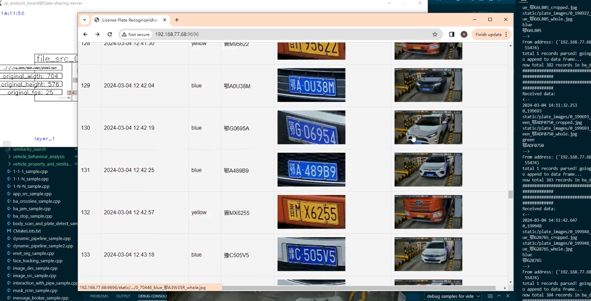
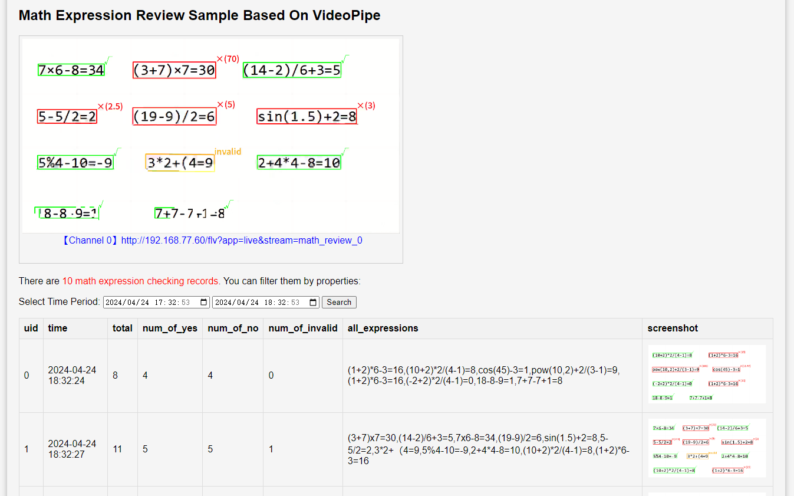
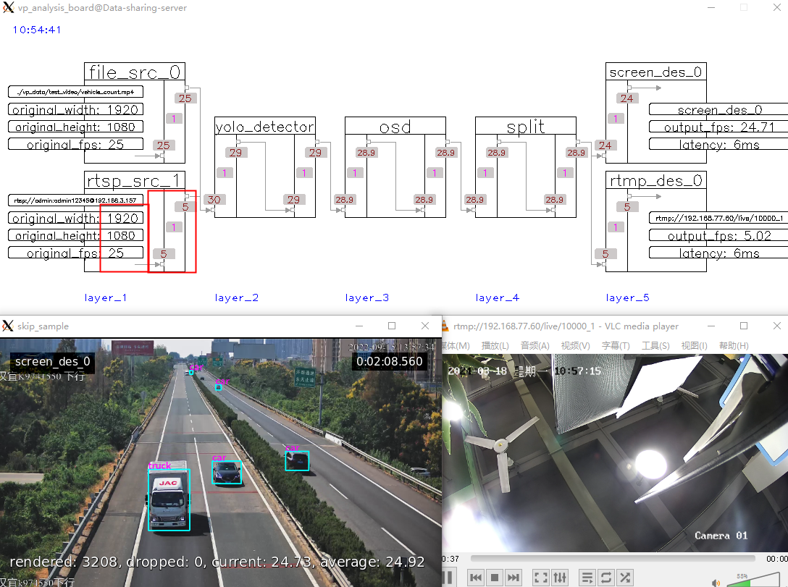
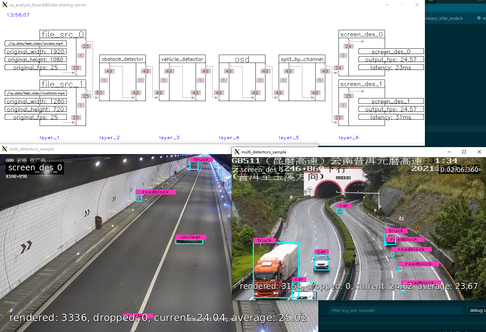
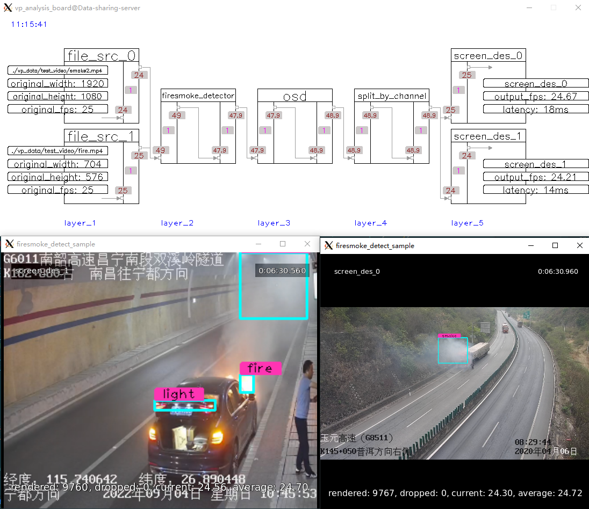
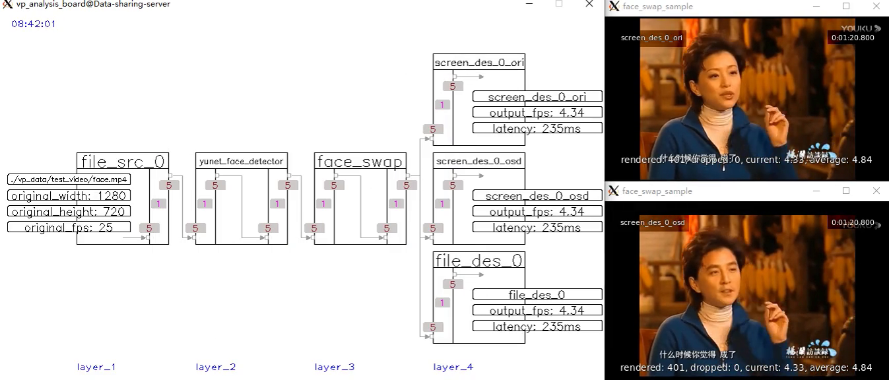
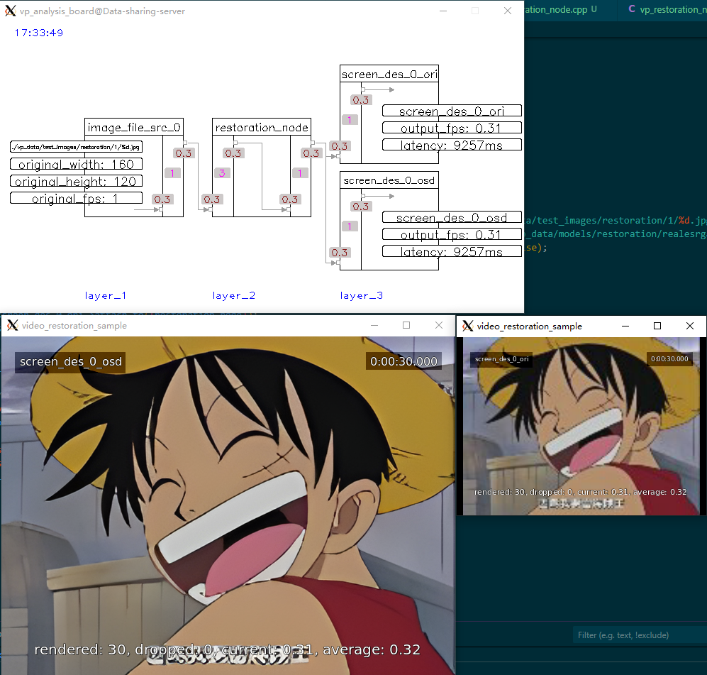
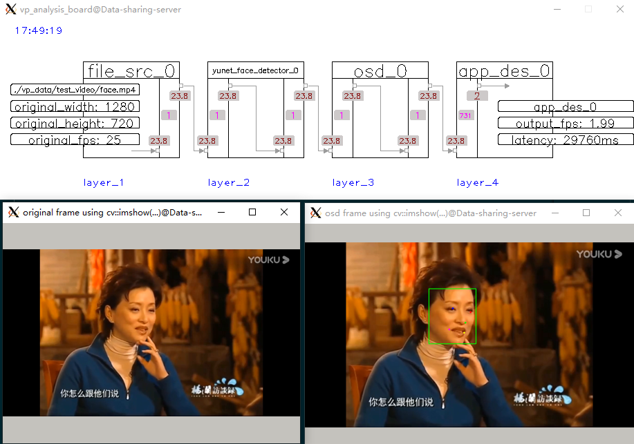
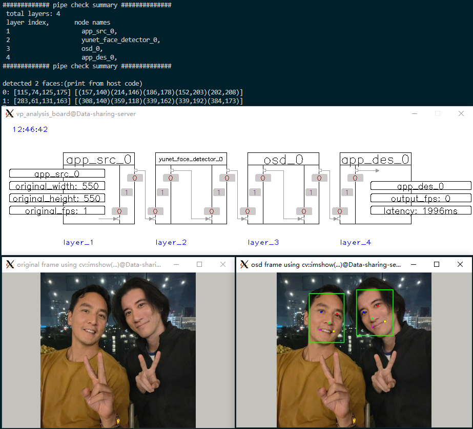
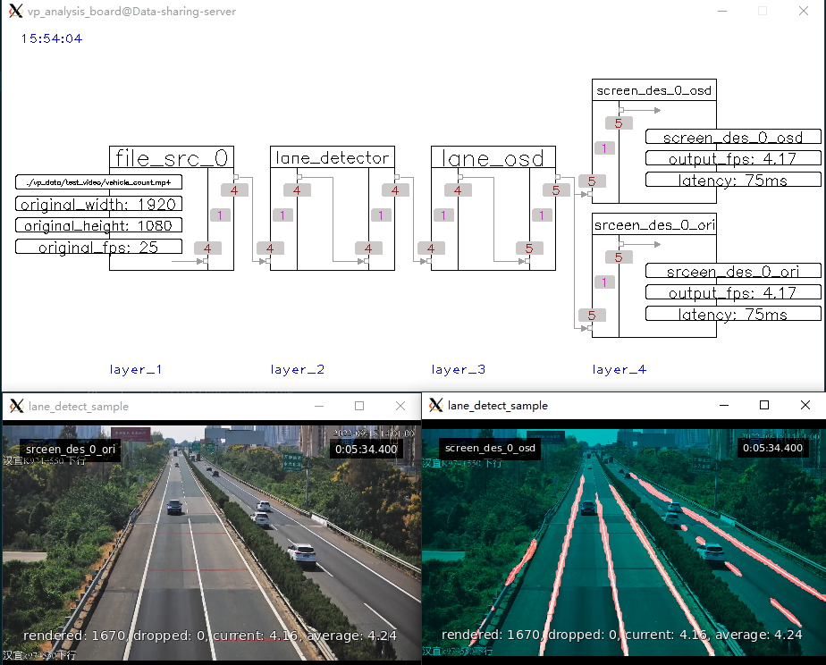

## 视频演示 ##
### AI换脸 ###
https://github.com/sherlockchou86/video_pipe_c/assets/13251045/aa1162f3-2f61-4ac7-8add-12d9f8b7ab23

### 车辆分类聚合 ###
https://github.com/sherlockchou86/video_pipe_c/assets/13251045/867b981b-5d8c-4ee3-9831-9c755b520ad6

### 以图搜车 ###
https://github.com/sherlockchou86/video_pipe_c/assets/13251045/a0ae5422-904b-4ad1-8201-3e1a07477882

### 停车检测 ###
https://github.com/sherlockchou86/video_pipe_c/assets/13251045/dd518798-6345-4121-a4d5-ad5bde18e3f3

### 车辆行为分析 ###
https://github.com/sherlockchou86/video_pipe_c/assets/13251045/3c115d3b-45e4-4df9-8459-bfadca974e4c

### 拥堵检测 ###
https://github.com/sherlockchou86/video_pipe_c/assets/13251045/b31612ae-6b44-4cbd-8439-610bd71834d5

### 人脸识别 ###
https://github.com/sherlockchou86/video_pipe_c/assets/13251045/7958c5e3-4e6e-453b-bde9-663779d960cb

### 动态管道 ###
https://github.com/sherlockchou86/video_pipe_c/assets/13251045/7fe3e45d-e528-4315-ba4f-21c3f11163e3

### 车牌识别相机 ###
https://github.com/sherlockchou86/video_pipe_c/assets/13251045/f680dccf-92c3-41eb-a472-7f0e27c28257

### 并行任务、数据同步 ###
https://github.com/sherlockchou86/video_pipe_c/assets/13251045/28a71383-8864-4a25-8da3-27922f0b5baf

### 口算检查 ###
https://github.com/sherlockchou86/video_pipe_c/assets/13251045/9c3c1a87-d9f7-4630-a541-96610d564f13

## 案例原型 ##

|id|sample|screenshot|
|--|--|--|
|1|1-1-1_sample||
|2|1-1-N_sample||
|3|1-N-N_sample||
|4|N-1-N_sample||
|5|N-N_sample||
|6|paddle_infer_sample||
|7|src_des_sample||
|8|trt_infer_sample||
|9|vp_logger_sample|-|
|10|face_tracking_sample||
|11|vehicle_tracking_sample||
|12|interaction with pipe sample|--|
|13|record_sample|--|
|14|message_broker_sample & message_broker_sample2||
|15|mask_rcnn_sample||
|16|openpose_sample||
|17|enet_seg_sample||
|18|multi detectors and classifiers sample||
|19|image_des_sample||
|20|image_src_sample||
|21|rtsp_des_sample||
|22|ba_crossline_sample||
|23|plate_recognize_sample||
|24|vehicle body scan sample||
|25|body scan and plate detect sample||
|26|app_src_sample||
|27|vehicle cluster based on classify encoding sample||
|28|ba_stop_sample||
|29|behaviour analysis||
|30|similiarity search||
|31|property and similiarity search||
|32|ba_jam_sample||
|33|face recognize||
|34|license plate recognize(LPR) camera||
|35|math expression check||
|36|skip_sample||
|37|obstacle_detect_sample||
|38|firesmoke_detect_sample||
|39|face_swap_sample||
|40|video_restoration_sample||
|41|app_des_sample||
|42|app_src_des_sample||
|43|lane_detect_sample||
