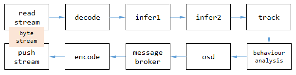
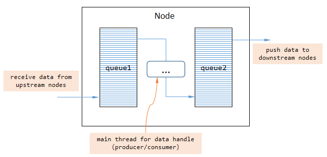
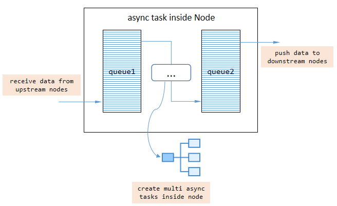
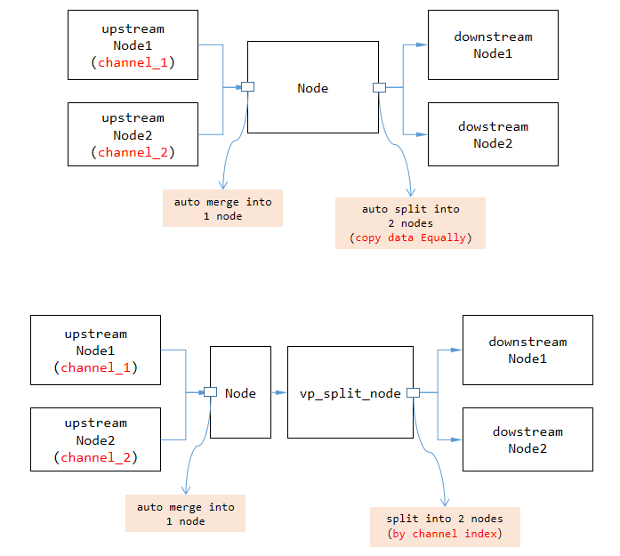
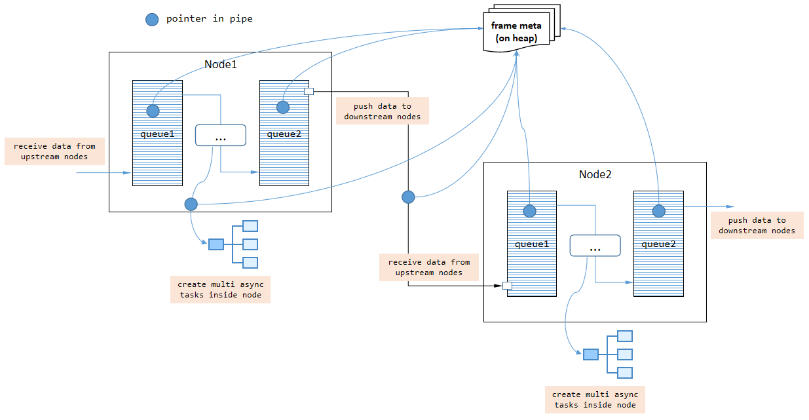
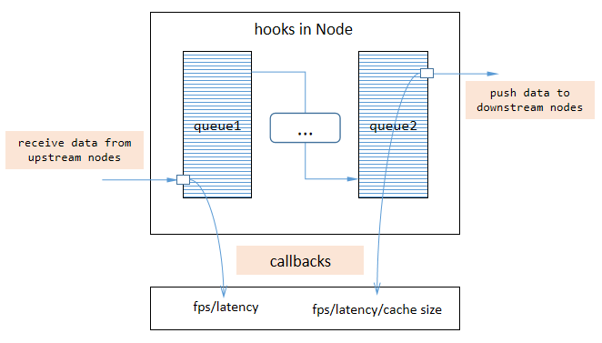
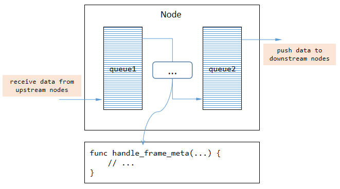

here are important instructions for VideoPipe if you want to figure out how it works!

## Core parts in video structured application ## 
`video structured` is a process which converts unstructure data (video here) into structured data. unstructure data:
- video
- image
- audio
- nature text

and structure data mainly includes something like json, xml or data table in DataBase which can by processed directly by machine (program).

Specifically in terms of video, the process of structured mainly involves these core parts:
1. `read stream`. capture video stream from network or local machine.
2. `decode`. decode byte stream to frames, algorithm/procedure can only act on images.
3. `inference`. deep learning work on images, detect, classification or feature extraction.
4. `track`. track on objects in video.
5. `behaviour analysis` (optional). analysis on objects' tracks.
6. `osd`. on screen display, show results on images for debug purpose or intuitive effects.
7. `message broker`. push structured data to external.
8. `encode`. encode frames which contains results to byte stream for transfer/serialization purpose.
9. `push stream`. push byte stream to external or save it directly.

figure 1. core parts in video structured application. 

each core part in `video structured` corresponding to one type of plugin in `VideoPipe`, namely **`Node`** in code.

## Node in VideoPipe ##
one `Node` in VideoPipe responsible for single task such as decoding or inference. we put many nodes together to construct a pipe, and let video data flow through the whole pipeline. every `Node` has 2 queues inside, one is for caching data from upstream nodes and another one is for caching data waiting for being pushed to downstream nodes. we can write logic code between the 2 queues, they are typical `producer-consumer` pattern.

figure 2. what Node looks like? 

by default, producer and consumer work with single thread inside node, we need write async code when deal with complex tasks (for example, pushing data is a time-consuming operation in `vp_message_broker_node`) to avoid blocking the pipeline.

figure 3. async task inside Node. 

there are 3 types of `Node` in VideoPipe, namely:
- `SRC Node`. source node where data was created (only 1 queue inside used for caching data being pushed to downstream nodes).
- `MID Node`. middle node where data would be handled.
- `DES Node`. destination node where data disappears (only 1 queue inside used for caching data from upstream nodes).

each `Node` `itself` has the ability to merge multi upstream nodes, and split into multi downstream nodes as well. note that `Node` use shallow-copy and copy Equally when data transfered from one node to other nodes by default, if you need deep-copy or want to transfer data by channel index (just hope data unconfused), add a `vp_split_node` at the point of spliting which would get different behaviour.

figure 4. merge & split in VideoPipe. 

## Data flow in VideoPipe ##
video (frame here) is a type of heavyweight data, so deep copying frequently would decrease the performance of pipeline. actually data transfered between 2 nodes in VideoPipe use `smart pointers` by default, once data was created by source nodes, the data content would NOT be copyed later at most time in the whole pipeline (but we can specify deep-copy if we need, using `vp_split_node` for instance).

figure 5. how data flows in VideoPipe. 

video consist of continuous frames, VideoPipe handle these frames One by One, so the `frame index` in frame meta would increase continuously as well.

## Hooks in VideoPipe ##
hook is a mechanism which let host notify listeners when something happens, VideoPipe support hooks as well. pipeline invokes callback functions (via `std::function` object) to communicate with external code, such as export `fps`, `latency` and other status of pipeline itself. we should NOT block the callback functions when writing custom code inside it.

figure 6. hooks in VideoPipe. 

hooks help to debug with our application and quickly find the bottleneck in whole pipe, visualization tool `vp_analysis_board` works depend on hooks.

## Implement new Node type in VideoPipe ##
`vp_node` is the base class for all nodes in VideoPipe. we can define a new node class derived from `vp_node` and override some virtual functions like `handle_frame_meta` and `handle_control_meta`.
- `handle_frame_meta`. handle frame data flowing current node.
- `handle_control_meta`. handle control data flowing current node.

figure 7. override virtual functions in custom Node. 

frame data means `vp_frame_meta` in VideoPipe, contains data related to frame such as `frame index`, `data buffer`, `original width`. control data means `vp_control_meta` in VideoPipe, contains data related command such as `record video`, `record image`.

note, NOT all data flowing current node should be handled using new logic, they just pass through if no operations work on them. we just need handle what we are interested in. 

## Hardware Acceleration in VideoPipe ##
some operations in `video structured` applications can benefit from hardware such as GPUs/NPUs. for example, video encoding on GPUs have higher speed/performace than CPUs. VideoPipe support hardware acceleration for these parts:

- decode/encode. based on HARD decode/encode gstreamer plugins, [look more](https://github.com/sherlockchou86/video_pipe_c/blob/master/doc/env.md#about-hardware-acceleration).
- inference. no doubt about it.
- osd. need implement based on hardware acceleration SDKs by yourself.

it is important to note that, although VideoPipe support hardware acceleration for above logic, they could NOT share memory between each others. it means that data will be copyed from GPU to CPU over and over again, which is the biggest disadvantage compared to other similar SDKs such as DeepStream.
