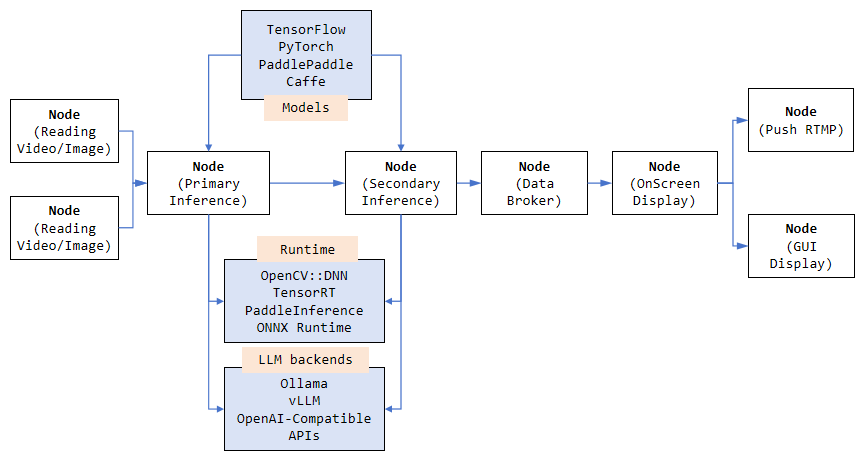
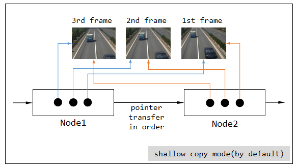
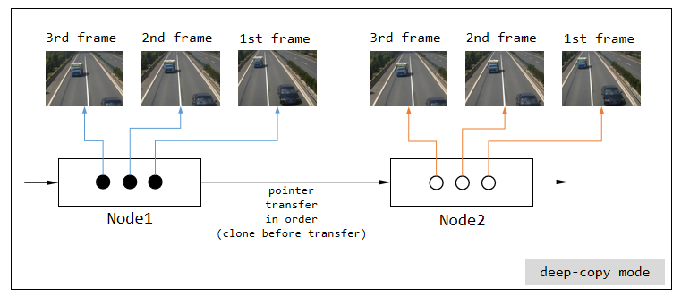
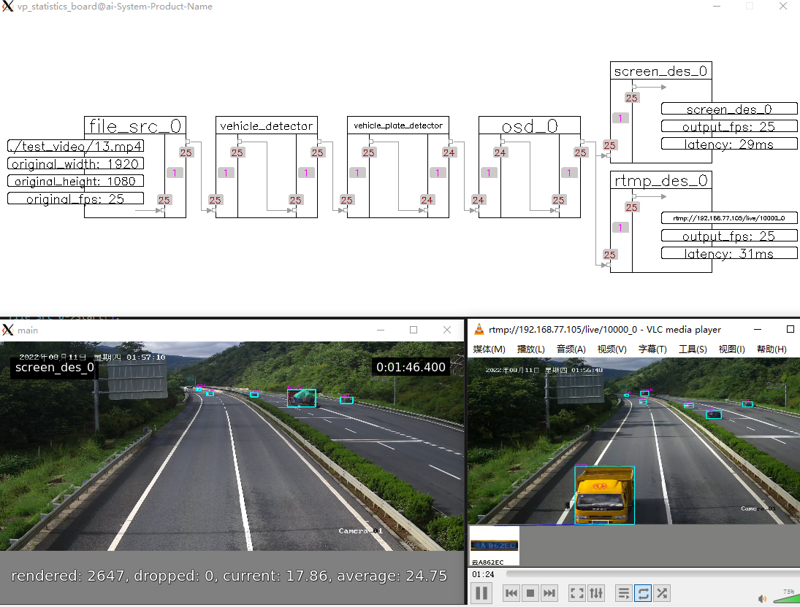
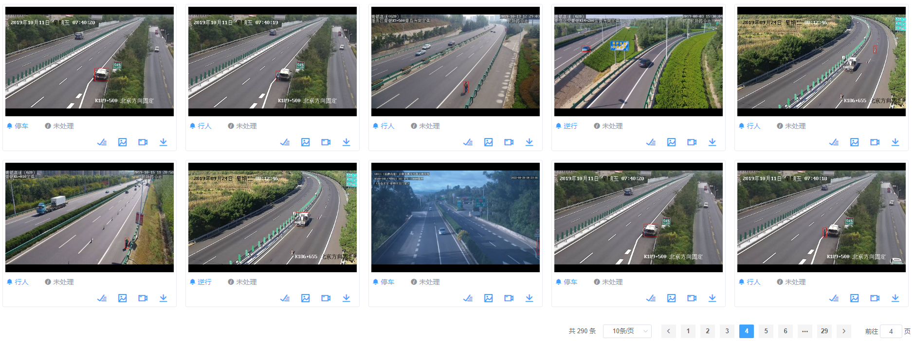
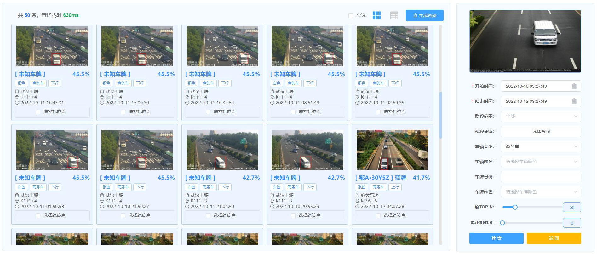

## VideoPipe [under development yet]

https://user-images.githubusercontent.com/13251045/192935445-d39a41af-4619-4ae1-a975-19de44014fa2.mp4

https://user-images.githubusercontent.com/13251045/192935363-70fe8a81-d84f-4ef6-91b0-08e1b5d94eac.mp4

A framework for video structured. It could handle complex tasks such as stream reading(from local or network), video decoding, inference based on deeplearning models, osd(on screen display), message broker via middleware(like kafka), video encoding and stream pushing(rtmp or local file). It's Plugin-Oriented coding style, we can construct different types of pipeline using independent plugins namely `Node` in framework. 

VideoPipe works like DeepStream from Nvidia and MindX SDK from Huawei, but it is more simple to use, more portable and has few dependency on third-party modules such as gstreamer which is hard to learn(coding style or debug). The framework is written purely by native C++ STL, and depends on popular modules like OpenCV, so the code is more portable for different platforms.


The framework can be used in such situations:
1. Video Structure
2. Image Search
3. Face Recognition
4. Behaviour Analyse based on Video (Security and Safety)

> NOTE: <br/>
> VideoPipe is a framework aimed to make model-integration more simple in CV field, it is not a deeplearning related frameworks such as tensorflow, tensorrt.

[中文说明(知乎)](https://zhuanlan.zhihu.com/p/544978583) | [中文说明(CSDN)](https://blog.csdn.net/xiaozhi_5638/article/details/126352185) | [中文说明(博客园)](https://www.cnblogs.com/xiaozhi_5638/p/16520710.html)

## Key Features
- `Stream Reading`. Support popular protocals such as udp, rtsp, rtmp, file.
- `Video Decoding`. Support video decoding which is based on opencv/ffmpeg.
- `Inference based on dl`. Support multi-level inference based on deep learning models, such as Object-Detection, Image-Classification, Feature-Extraction. What you need is preparing models and know how to parse its outputs. Inference can be implemented based on different backends such as opencv::dnn(default), tensorrt, paddle_inference, onnx runtime.
- `On Screen Display(OSD)`. Support visualization, like drawing outputs from model onto frame.
- `Message Broker[not implemented yet]`. Support push structured data(via json) to cloud or other platforms.
- `Object Tracking[not implemented yet]`. Support object tracking such as iou, sort etc.
- `Behaviour Analyse[not implemented yet]`. Support behaviour analyse based on tracking.
- `Recording[not implemented yet]`. Support video recording for specific period, screenshots for specific frame.
- `Video Encoding`. Support video encoding which is based on opencv/ffmpeg.
- `Stream Pushing`. Support stream pushing via rtmp, rtsp, file.

## Highlights

1. Visualization for pipelines, which is useful when debugging. The running status of pipeline refresh automatically on screen, including fps, cache size, latency at each link in pipeline, We can figure out quickly where the bottleneck is based on these running information.
2. Data transfered between 2 nodes by smart pointer which is shallow-copy by default, no content copy operations needed when data flowing through the whole pipeline. But, we can specify deep-copy if we need, for example, when the pipeline has multi branches and we need operate on 2 different contents separately.
3. We can construct different types of pipeline, only 1 channel in a pipeline or multi channels in a piepline are both supported, channels in pipeline are independent. 
4. The pipeline support hooks, we can register callbacks to the pipeline to get the status notification(see the 1st item), such as fps.
5. Many node classes are already built-in in VideoPipe, but all nodes in framework can be re-implemented by yourself and also you can implement more based on your requirements.
6. The whole framework is written mainly by native C++ which is portable to all paltforms. 

2 modes to transfer data:




## Help doc
- [sample code](./sample/readme.md)
- [node table](./nodes/readme.md)
- [how record works](./nodes/record/readme.md)
- [environment for reference](./doc/env.md)
- wait for update...

## Dependency

Basicis
- ubuntu 18.04 x64 (other platforms waiting for test)
- vscode (remote development on windows)
- c++ 17
- opencv 4.6
- ffmpeg 3.4 (required by opencv)
- gstreamer 1.20 (required by opencv)
- gcc 7.5

Optional, if you need implement(or use built-in) infer nodes based on other inference backends other than opencv::dnn.
- cuda, tensorrt
- paddle inference
- onnx runtime
- anything you like

[environment for reference](./doc/env.md)

## How to build and debug
### option1: shell & vscode
- Build VideoPipe (via shell)
    - run `cd build/`
    - run `sh build.sh`
    - it will generate a library called libvp.so and copy it to /usr/local/lib automatically.


- Debug VideoPipe (via vscode)
    - select the cpp file you want to debug (keep it activated), like `./sample/1-1-1_sample.cpp`
    - press `run` button at debug menu in vscode
    - select a launch item at the top of window (something like `C/C++: g++ vp project`)


> All sub projects in `./third_party/` are independent projects and can be built and debug like above, please refer to readme.md in sub folder.

### option2: cmake & CLion
#### prepare enviroments

Place `heads` to `/usr/local/include`,  `libraries` to `/usr/lib/x86_64-linux-gnu`, or use soft link.

For example, `cuda` include directories is `/usr/local/include/cuda`. 

You can also organize the header files and the libraries to your liking. 

#### build samples
```shell
mkdir build # if not exist
cd build
cmake ..
make
```
You will get dynamic libraries and executable samples in `build`.

#### debug
Use IDEs such as *CLion* which will read the `CMakeLists.txt` and generate debug configurations.


## How to use 

- build VideoPipe first and use shared library.
- referencing source code directly and build your whole application.

[download models and test files from Google Drive](https://drive.google.com/file/d/14J8RFK_vJFXBp_ER4sb5Oh8uJTyLyyK_/view?usp=sharing)

[download models and test files from Baidu Pan(wait for update)]()

demo code show how to construct pipeline and run it(first change file path in code):
```c++
#include "VP.h"

#include "../nodes/vp_file_src_node.h"
#include "../nodes/infers/vp_trt_vehicle_detector.h"
#include "../nodes/infers/vp_trt_vehicle_plate_detector.h"
#include "../nodes/osd/vp_osd_node_v2.h"
#include "../nodes/vp_screen_des_node.h"
#include "../nodes/vp_rtmp_des_node.h"
#include "../utils/analysis_board/vp_analysis_board.h"

#if MAIN
int main() {
    // create nodes
    auto file_src_0 = std::make_shared<vp_nodes::vp_file_src_node>("file_src_0", 0, "./test_video/13.mp4");
    auto trt_vehicle_detector = std::make_shared<vp_nodes::vp_trt_vehicle_detector>("vehicle_detector", "./vehicle.trt");
    auto trt_vehicle_plate_detector = std::make_shared<vp_nodes::vp_trt_vehicle_plate_detector>("vehicle_plate_detector", "./det.trt", "./rec.trt");
    auto osd_0 = std::make_shared<vp_nodes::vp_osd_node_v2>("osd_0", "./font/NotoSansCJKsc-Medium.otf");
    auto screen_des_0 = std::make_shared<vp_nodes::vp_screen_des_node>("screen_des_0", 0, true, vp_objects::vp_size{640, 360});
    auto rtmp_des_0 = std::make_shared<vp_nodes::vp_rtmp_des_node>("rtmp_des_0", 0, "rtmp://192.168.77.105/live/10000", vp_objects::vp_size{1280, 720});

    // construct pipeline
    trt_vehicle_detector->attach_to({file_src_0});
    trt_vehicle_plate_detector->attach_to({trt_vehicle_detector});
    osd_0->attach_to({trt_vehicle_plate_detector});

    // split into 2 sub branches automatically
    screen_des_0->attach_to({osd_0});
    rtmp_des_0->attach_to({osd_0});

    // start pipeline
    file_src_0->start();

    // visualize pipeline for debug
    vp_utils::vp_analysis_board board({file_src_0});
    board.display();
}
#endif
```
the above code will generate 3 visualizations:
1. pipeline with status refreshing automatically
2. frame display via screen (window gui)
3. frame display via rtmp (video player)



## How to contribute
The project is under development currently, any PRs would be appreciated.

note, the code, architecture may be not stable (2022/9/29)

## Compared to other similar sdk

VideoPipe is opensource totally and more portable for different soft/hard-ware platforms. DeepStream/MindX are platform-depended, maybe they can get better performance for some modules like decoding, inference, osd (for example, memory shared in GPU/NPU for all operations).


## Can do

The products below borrow some experience/ideas from VideoPipe:
> Note: they are not developed by VideoPipe totally.

### behaviour analysis



### image/video search

