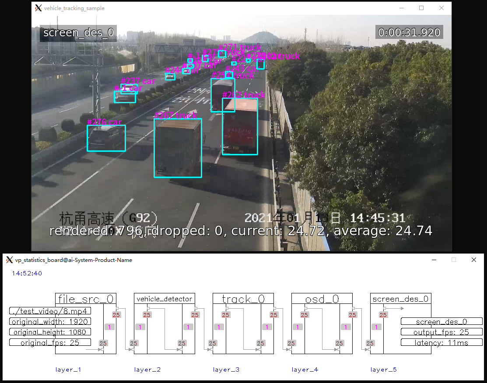

## 1-1-1_sample ##
1 video input, 1 infer task, and 1 output.

## 1-1-N_sample ##
1 video input, 1 infer task, and 2 outputs.

## 1-N-N_sample ##
1 video input and then split into 2 branches for different infer tasks, then 2 total outputs.

## N-1-N_sample ##
2 video input and merge into 1 branch automatically for 1 infer task, then resume to 2 branches for outputs again.

## N-N_sample ##
multi pipe exist separately and each pipe is 1-1-1 (can be any structure like 1-1-N, 1-N-N)

## paddle_infer_sample ##
ocr based on paddle (install paddle_inference first!), 1 video input and 2 outputs (screen, rtmp)

## src_des_sample ##
show how src nodes and des nodes work.
3 (file, rtsp, udp) input and merge into 1 infer task, then resume to 3 branches for outputs (screen, rtmp, fake)

## trt_infer_sample ##
vehicle and plate detector based on tensorrt (install tensorrt first!), 1 video input and 3 outputs (screen, file, rtmp)

## vp_logger_sample ##
show how `vp_logger` works.

## face_tracking_sample ##
tracking for multi faces.

## vehicle_tracking_sample ##
tracking for multi vehicles.

## interaction_with_pipe_sample ##
show how to interact with pipe, such as start/stop channel by calling api.

## record_sample ##
show how `vp_record_node` works.
