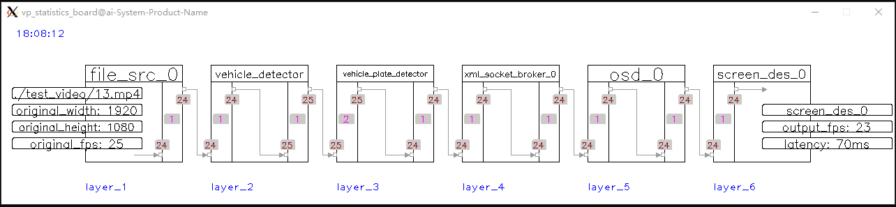

## 1-1-1_sample ##
1 video input, 1 infer task, and 1 output.

## 1-1-N_sample ##
1 video input, 1 infer task, and 2 outputs.

## 1-N-N_sample ##
1 video input and then split into 2 branches for different infer tasks, then 2 total outputs.

## N-1-N_sample ##
2 video input and merge into 1 branch automatically for 1 infer task, then resume to 2 branches for outputs again.

## N-N_sample ##
multi pipe exist separately and each pipe is 1-1-1 (can be any structure like 1-1-N, 1-N-N)

## paddle_infer_sample ##
ocr based on paddle (install paddle_inference first!), 1 video input and 2 outputs (screen, rtmp)

## src_des_sample ##
show how src nodes and des nodes work.
3 (file, rtsp, udp) input and merge into 1 infer task, then resume to 3 branches for outputs (screen, rtmp, fake)

## trt_infer_sample ##
vehicle and plate detector based on tensorrt (install tensorrt first!), 1 video input and 3 outputs (screen, file, rtmp)

## vp_logger_sample ##
show how `vp_logger` works.

## face_tracking_sample ##
tracking for multi faces.

## vehicle_tracking_sample ##
tracking for multi vehicles.

## interaction_with_pipe_sample ##
show how to interact with pipe, such as start/stop channel by calling api.

## record_sample ##
show how `vp_record_node` works.

## message_broker_sample & message_broker_sample2 ##
show how message broker nodes work.

## mask_rcnn_sample ##
show image segmentation by mask-rcnn.

## openpose_sample ##
show pose estimation by openpose network.

## enet_seg_sample ##
show semantic segmentation by enet network.

## multi_detectors_and_classifiers_sample ##
show multi infer node work together.

## image_des_sample ##
show save/push image to local file or remote via udp.

## image_src_sample ##
show read/receive image from local file or remote via udp.

## rtsp_des_sample ##
show push video stream via rtsp, no rtsp server needed, you can visit it directly.

## ba_crossline_sample ##
count for vehicle based on tracking, the simplest one of behaviour analysis.

## plate_recognize_sample ##
vehicle plate detect and recognize on the whole frame (no need to detect vechile first)
