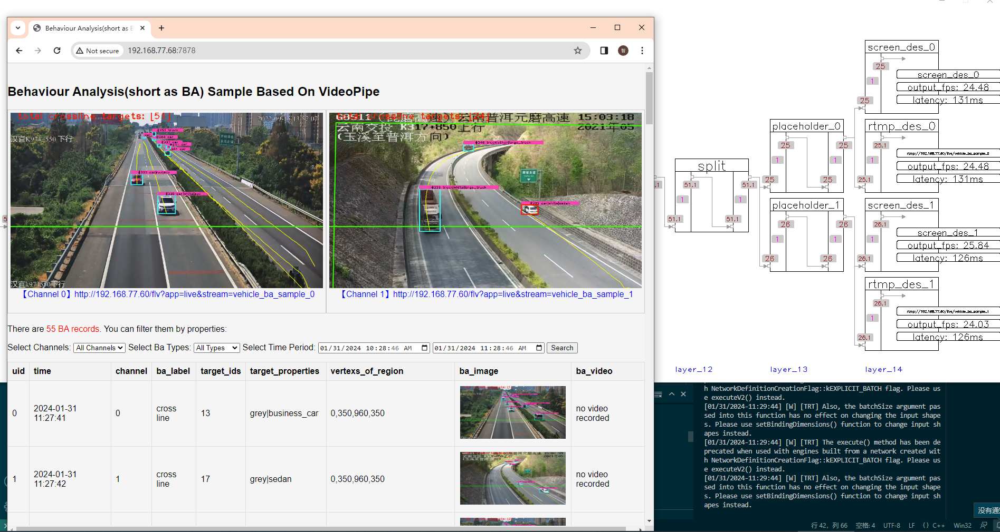

# behaviour analysis #

Demonstrate behaviour analysis using VideoPipe.

1. `vehicle_ba_pipeline.cpp` run a pipeline to do BA on vehicle targets and send BA results (crossline, stop, ...) via socket (using message broker node in VideoPipe)
3. `vehicle_ba_server.py` receive BA data via socket and start a web server powered by `flask` to demonstrate how to display BA data on UI.
4. `clean.sh` help to clean all cache data in current sample directory.

```
### how to use ###
step1. compile `vehicle_ba_pipeline.cpp` and run binary file, it will generate BA results. (change des_ip first)
step2. run `vehicle_ba_server.py` script to receive BA related data and start web server, then open url in your browser to fetch BA results. (change `bind_ip` and `rtmp urls` in script first)
```

```
### data flow ###
1.[pipeline -> BA results and other related data -> send via socket] -> 2.[receive BA data -> display BA results from web]
```

```
please run `sh clean.sh` if you want to restart sample from scratch.
```

# screenshot #
**cross line**



**stop**

