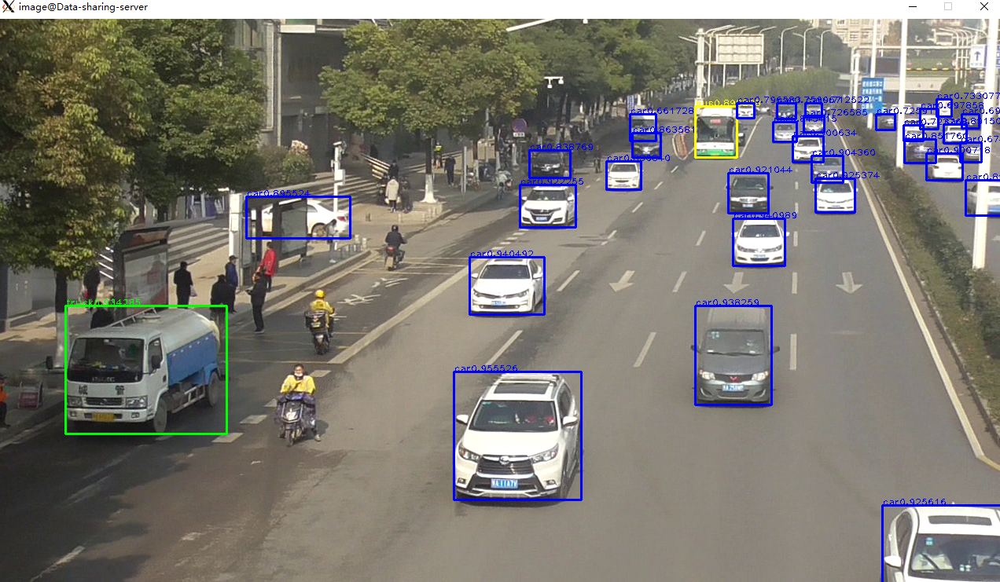
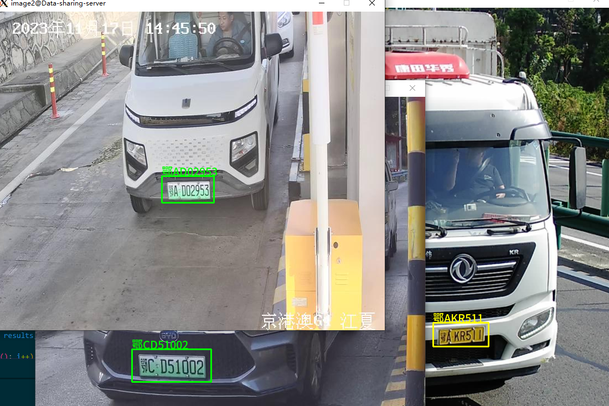
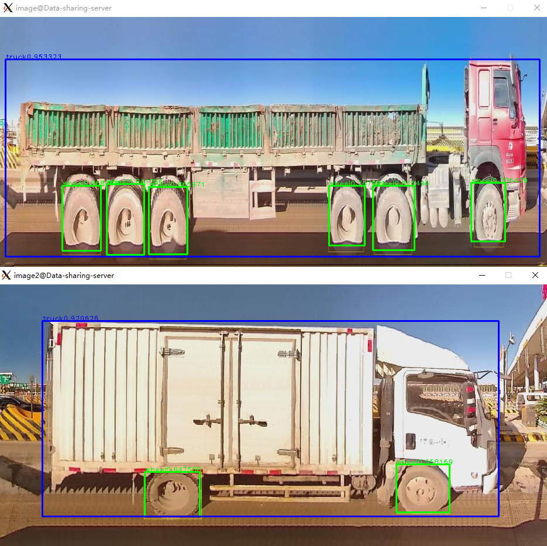
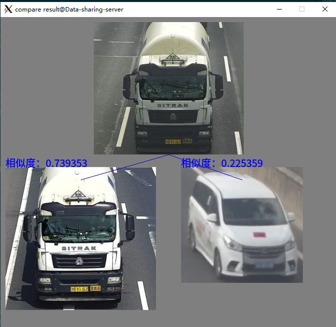

## What `trt_vehicle` can do:
1. Vehicle detector
2. Vehicle plate detector and recognizer
3. Vehicle scanner based on side view of body
4. Vehicle color and type classifier
5. Vehicle feature encoder used for search(1:N) or comparison(1:1) 


## How to install tensorrt and cuda ?
Refer to NVIDIA official web
1. download files according to your GPUs (below for this repo) `cuda_11.1.0_455.23.05_linux.run`, `cudnn-11.1-linux-x64-v8.0.5.39.tgz`, `TensorRT-7.2.1.6.Ubuntu-18.04.x86_64-gnu.cuda-11.1.cudnn8.0.tar.gz`
2. run `./cuda_11.1.0_455.23.05_linux.run` install cuda(at `/usr/local`) and driver, maybe need to reboot machine some times
3. upzip `cudnn-11.1-linux-x64-v8.0.5.39.tgz` , copy all header files to '/usr/local/cuda/include' and copy all lib files to '/usr/local/cuda/lib64'
4. unzip `TensorRT-7.2.1.6.Ubuntu-18.04.x86_64-gnu.cuda-11.1.cudnn8.0.tar.gz` at `/usr/local`, create softlink by `ln -s /usr/local/TensorRT-7.2.1.6 /usr/local/tensorRT`
5. add `export LD_LIBRARY_PATH=$LD_LIBRARY_PATH:/usr/local/tensorRT/lib:/usr/local/cuda/lib64:/usr/local/lib`, `export CPATH=$CPATH:/usr/local/cuda/include:/usr/local/tensorRT/include` to `~/.bashrc`
6. run `source ~/.bashrc`


>> CUDA 11.1 + TensorRT 7.2.1 for this repository (tested)
>>
>> CUDA 11.1 + TensorRT 8.5 for this repository (tested)

## How to generate trt model from onnx ?
```shell
trtexec --onnx=./vehicle.onnx --saveEngine=vehicleXXX.trt --buildOnly=true
```

## How to build trt_vehicle ?

1. `cd ./build`, and run `sh ./build.sh`.
2. It will generate a `.so` library named `libtrt_vehicle.so`.
3. Or include source code directly, no `.so` library needed.


## How to debug for trt_vehicle ?

Make sure you have build `trt_vehicle` correctly
1. Change model paths to your specific values in `./main/*.cpp`.
2. Select one of `./main/*.cpp` files and click `Run` button in vscode, choose one launch item at the top of window(`trt_vehicle`).

## Sample screenshot ##
### vehicle detect

## vehicle plate detect

## vehicle scan

## vehicle color and type classify

## vehicle compare

